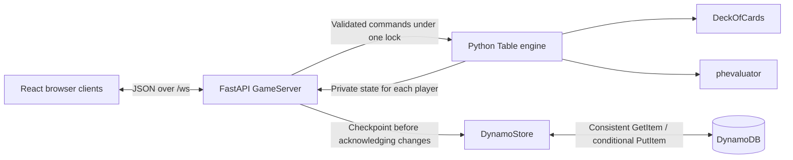

# How Headwins Poker works

Headwins Poker is a browser-based, play-money Texas Hold’em app for two to nine
players. Everyone joins one shared table. The browser displays the game and sends
player intentions; the Python backend validates those intentions and owns the
authoritative game state.

## System overview

One backend process owns the live table and sockets. When `DYNAMODB_TABLE` is set,
DynamoDB stores a durable checkpoint of seats, session tokens, chip balances,
hand recovery information, and the rolling activity history. Without that setting,
the app runs in memory only.

## Main components

| Component | Responsibility | Source |
| --- | --- | --- |
| Browser UI | Name entry, table and card rendering, action controls, stack adjustments, chat, and connection recovery. React state holds the latest server snapshot and local form/connection state. | [App.tsx](../frontend/src/App.tsx), [main.tsx](../frontend/src/main.tsx) |
| WebSocket server | Accept connections, parse and validate messages, associate sockets with player sessions, serialize game access, and broadcast individual player views. Also exposes `GET /health`. | [main.py](../backend/main.py) |
| Game engine | Own seats, chips, dealer/turn order, betting streets, legal actions, payouts, and the public/private view of a table. It is synchronous and independent of WebSocket transport. | [game.py](../backend/game.py) |
| Persistence | Serialize private recovery checkpoints, restore the table at startup, and prevent stale checkpoint overwrites using a version condition. boto3 calls run off the event loop. | [storage.py](../backend/storage.py), [requirements.txt](../backend/requirements.txt) |
| AWS infrastructure | A provisioned DynamoDB table and separate project/service monitoring budgets, deployed through CloudFormation. | [dynamodb.yaml](../infra/dynamodb.yaml), [budgets.yaml](../infra/budgets.yaml) |
| Cards and evaluation | Create, shuffle, and draw from a 52-card deck; use `phevaluator` to rank hands at showdown. | [deck_of_cards.py](../backend/deck_of_cards.py), [requirements.txt](../backend/requirements.txt) |
| Frontend tooling | Vite serves the development UI and builds static production assets; TypeScript and ESLint check the frontend. | [vite.config.ts](../frontend/vite.config.ts), [package.json](../frontend/package.json) |

## From joining to taking a turn

1. A player enters a display name. The browser opens `/ws` and sends a `join`
   message with the name and any saved session token.
2. The backend creates a seat or restores a retained seat matching that token.
   It returns a `session` message containing the player ID and token, then sends
   each connected player a `state` message with their own complete table view.
3. The first connected seat is the host. The host can deal when at least two
   connected players have chips. New players joining during a hand wait for the
   next one.
4. The browser sends commands such as `fold`, `check_call`, or `raise`. A raise's
   `amount` is the total commitment for the current betting street. `start`,
   `set_stack`, and `chat` cover dealing, between-hand stack changes, and messages.
5. FastAPI handles game commands under one `asyncio.Lock`. The engine checks the
   action, changes the table, and advances play as needed. Invalid requests
   receive an `error` message; frontend button restrictions are only a convenience,
   and the backend enforces the rules.
6. With persistence enabled, the server saves changed state before acknowledging
   joins or broadcasting fresh snapshots, generated separately for each player.
   React replaces its displayed state with the snapshot and clears the pending
   action indicator. There is no client-side simulation or incremental event replay.

## Game lifecycle and state ownership

The table begins in `waiting`, moves through `preflop`, `flop`, `turn`, and `river`,
and ends in `complete`. A hand can finish early when only one player remains.
When no further betting is possible, the engine automatically runs out the board.
The result stays visible until the host deals again.

The engine owns blinds, dealer rotation, turn order, minimum raises, all-in
eligibility, main/side pots, ties, and uncalled-chip returns. Chips are integers;
players start with 1,000 and blinds are 5/10. Players can set their own stack
between hands. Chat and game activity share a rolling history of 100 entries.

`Table.state(viewer)` is the privacy boundary. It includes public seat information,
the board and betting state, the viewer's hole cards, and server-computed action
limits. Opponents' hole cards are absent until a contested showdown exposes the
remaining hands in the result. Session tokens are sent in the joining player's
session response, not in table snapshots.

## Sessions and connection recovery

The browser saves its name and token in tab-scoped `sessionStorage`. After a
connection closes, it retries with exponential backoff capped at ten seconds and
uses the token to reclaim its seat. A second connection using the same token
replaces the first; the old socket receives close code `4001` and stops retrying.
Tokens identify seats; the app has no account or password authentication.

With DynamoDB enabled, startup restores retained seats as disconnected. If the
last saved hand was unfinished, recovery cancels it and refunds each player's
contribution, preserving chip totals. Completed payouts are never refunded. Players
reclaim seats with their existing tab tokens; normal between-hand pruning still
applies. This is recovery of a casual game, not replay of an interrupted hand.

A disconnected player with chips folds an active hand. An all-in player remains
eligible for the pot. Reconnection does not undo a fold. Seats are retained during
hands to preserve order; a new join between hands prunes disconnected seats, so
restoration depends on the seat still existing. The host role follows the first
connected seat.

Broadcasts send concurrently to connected sockets while holding the game lock,
with a two-second timeout per send. Failed sockets are removed, the engine applies
disconnect behavior, and surviving clients receive the repaired state. This
keeps mutations and the snapshots describing them ordered.

## Durable storage and cost controls

The access patterns are one strongly consistent `GetItem` on startup and one
conditional `PutItem` per changed checkpoint. The partition key is
`pk=GAME#GLOBAL`; there are no scans, secondary indexes, streams, or database
reads per browser refresh. A schema-versioned JSON document is compressed into
the binary `payload` attribute, alongside an increasing `version`. The single
item bounds stored history and makes each save atomic. Identical checkpoints
skip writes. The saved format is separate from `Table.state(viewer)` and never
goes to browsers; compression is not encryption. DynamoDB's default AWS-owned key
encrypts storage at rest, and boto3 uses HTTPS and the normal AWS identity chain.

A failed or uncertain write, including a version conflict, stops the process
from accepting further game changes: sockets close with code `1011`, and
`/health` returns HTTP 503. Restart after resolving the storage problem to reload
the authoritative checkpoint. Startup read failures abort startup rather than
silently creating an empty game. Version checks prevent stale overwrites but do
not provide distributed game coordination; only one worker is supported.

The table uses Standard class with fixed 5 RCU / 25 WCU, below or equal to the
documented 25 RCU / 25 WCU free-tier allowances. Storage is a single bounded
checkpoint, far below 25 GB. No autoscaling, paid backups, global replicas, or
customer-managed KMS keys are enabled. Capacity exhaustion can throttle saves;
it does not increase provisioned capacity automatically. Table deletion is
protected and CloudFormation retains the table on deletion or replacement.

Both monitoring budgets alert above $0.01/month, excluding credits and refunds
so credits do not hide usage charges. One filters `Project=headwins-poker`; the
other covers all Amazon DynamoDB spending while tag-based billing becomes
available. The project tag must be activated as a cost allocation tag after AWS
discovers it. Budgets are delayed notifications, not spending caps. Free-tier
eligibility and account-wide usage still determine charges; a zero bill is not
guaranteed. See the README for deployment, activation, and verification commands.

## Running and deploying

During development, Vite proxies `/ws` and `/health` to the backend on port 8000.
The frontend normally derives the WebSocket address from the page's host and
protocol; `VITE_WS_URL` can override it.

For production, serve the Vite build as static files and proxy `/ws` to Uvicorn
with WebSocket upgrade support, or configure an explicit backend URL at build
time. HTTPS pages use secure WebSockets (`wss://`). The frontend and backend are
separate serving concerns; FastAPI does not serve the built UI.

Run **one backend worker**. The module-level `GameServer` contains a single
live table, and separate workers would create conflicting games. With DynamoDB
enabled, restarts recover durable checkpoints as described above; memory-only
mode still loses all state. Rooms, long-term hand archives, distributed
coordination, and real-money settlement are not implemented.

See the [project README](../README.md) for setup commands and hosting limits.

## Verification and documentation

[Engine tests](../backend/tests/test_game.py) exercise turn order, betting rules,
payouts, privacy, disconnects, and chip conservation, including randomized legal
hands. [API tests](../backend/tests/test_api.py) exercise the WebSocket contract,
sessions, invalid messages, and the single shared game using in-process clients.
[Persistence tests](../backend/tests/test_storage.py) verify restart refunds,
completed payouts, session/stack/chat recovery, conditional versions, and failure
behavior without AWS access. CloudFormation templates are checked with `cfn-lint`;
live deployment is verified through stack events and table/budget descriptions.
[GitHub Actions](../.github/workflows/checks.yml) runs the backend suite and frontend
lint/build checks on pushes and pull requests.

The local development environment also has Agent Toolkit for AWS installed: AWS
CLI browser authentication, global AWS skills, and an AWS MCP connection for
Codex. The MCP connection uses the named `lawang` CLI profile; toolkit services
use `us-east-1`. This is developer tooling, not an application dependency or a
deployed service. The backend's boto3 connection is independent of the MCP tooling;
[run.py](../backend/run.py) loads ignored local `.env` settings for development.
Production should supply environment settings and an IAM workload role with
`dynamodb:GetItem` and `dynamodb:PutItem` scoped to the table ARN. AWS guidance in
[AGENTS.md](../AGENTS.md) supplements the project rules; credentials and MCP
configuration remain outside the repository.

This document describes the implemented architecture. The Excalidraw files in
[`diagrams/`](../diagrams/) are original design sketches and may differ from it.
[AGENTS.md](../AGENTS.md) requires reviewing this guide with each code change and
updating affected explanations in the same change. That is a contributor workflow
rule; the CI checks do not automatically verify documentation accuracy.
