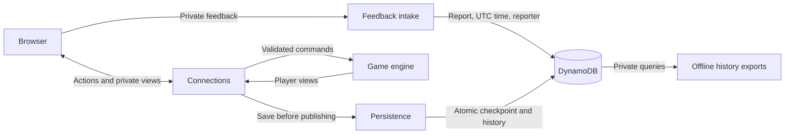

# How Headwins Poker works

Headwins Poker is a browser-based, play-money Texas Hold’em app for two to nine
players at one shared table, with nine fixed seats and no host or privileged seat.
Between hands, players can move to empty seats or remove another player. Anyone at the table can configure shared blinds, cents denominations, and automatic
next-hand dealing from Settings. The browser shows the game and sends player actions;
the backend owns the rules, chips, and authoritative state.

## The system at a glance

One backend process coordinates the live game. DynamoDB is optional: it keeps a
checkpoint for restart recovery and permanent game history, saved together.
Without it, the game lives only in memory and history is not retained. Feedback
uses the private history table independently of game checkpoints; submissions
require durable storage and are never broadcast to players.

## Modules

Start with the responsibility you want to understand. Each page explains its
behavior and links to the implementation.

| Module | Owns | Read for details |
| --- | --- | --- |
| Browser | Displaying the table and collecting player input. | [UI state and reconnecting](architecture/browser.md) |
| Connections | Sessions, request validation, and ordered updates to players. | [Command flow and WebSocket messages](architecture/connections.md) |
| Game | Poker rules, chips, turn order, payouts, and private player views. | [Game lifecycle and privacy](architecture/game.md) |
| Persistence | Atomic checkpoints, private history, and restart recovery. | [Checkpoints and failure handling](architecture/persistence.md) |

[Operations](architecture/operations.md) covers hosting, infrastructure, cost
monitoring, and verification. The [README](../README.md) contains setup commands.

## How a turn reaches everyone

A player joins or reconnects to a seat. When they act, the connection layer passes
the request to the game engine, which checks the rules and updates the table.
With persistence enabled, the server saves the checkpoint and associated history
in one transaction before sending each player a fresh view. The browser displays that view.

This division keeps game decisions on the server and opponents’ hidden cards out
of each player’s view. The browser never has to simulate the game itself.

## Boundaries to keep in mind

- **One shared game, one backend worker.** Multiple rooms and distributed game
  coordination are not implemented.
- **Browser identities outlive seats.** A saved browser credential identifies the
  same player across sessions, including after seat pruning. Cross-device accounts
  and identity recovery are not implemented.
- **History stays private.** The archive retains actions, cards, deck order, and
  results. Authorized offline exports calculate player net chips separately from
  rebuys and cash-outs; equity calculations and a history UI are future work.
- **Recovery preserves chips, not an interrupted hand.** Restarting with a saved
  checkpoint cancels unfinished hands and refunds contributions. Completed
  payouts remain intact. A storage failure stops play until recovery.

This guide describes the implemented system. Original sketches in
[`diagrams/`](../diagrams/) may differ. When changing the app, review this overview
and the affected module pages together, as required by [AGENTS.md](../AGENTS.md).
